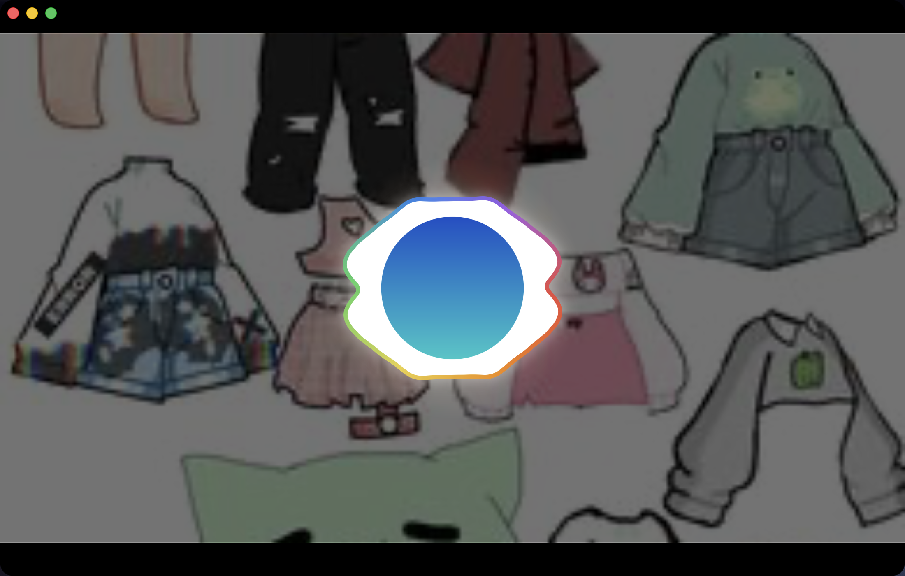
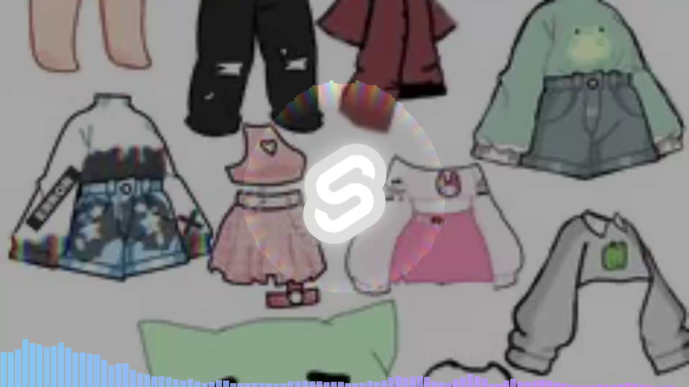

# Lindaris

Ein Audio-Visualizer für macOS: System-Audio live visualisieren, oder einen Song laden, eine Musikvideo-Szene bauen und als MP4 exportieren.



## Download

**[→ Neueste Version herunterladen](../../releases/latest)**

Universal Binary — läuft auf Apple Silicon (M1/M2/M3) und Intel-Macs.

## Installation

1. DMG öffnen, **Lindaris.app** in den Ordner *Programme* ziehen.
2. **Einmalig freigeben.** macOS blockiert die App beim ersten Start, weil sie nicht
   bei Apple notarisiert ist. Der zuverlässigste Weg ist ein Befehl im Terminal:

   ```
   xattr -cr /Applications/Lindaris.app
   ```

   Danach startet sie per Doppelklick — dauerhaft.

<details>
<summary>Ohne Terminal (macOS 15 und neuer)</summary>

1. App doppelklicken → macOS blockiert sie
2. **Systemeinstellungen → Datenschutz & Sicherheit** öffnen
3. Ganz nach unten scrollen: dort steht „Lindaris wurde blockiert …" mit dem Knopf
   **Trotzdem öffnen**
4. Klicken, mit Passwort oder Touch ID bestätigen

</details>

> **Warum das nötig ist:** Notarisierung setzt ein kostenpflichtiges Apple-Entwickler­konto
> voraus. Ohne sie markiert macOS jeden Browser-Download als „Quarantäne" und blockiert
> den Start. Der Befehl oben entfernt genau diese Markierung — an der App selbst ändert
> er nichts.
>
> **Hinweis:** Der früher übliche Weg *Rechtsklick → Öffnen* funktioniert seit macOS 15
> **nicht mehr** für nicht-notarisierte Apps. Nimm einen der beiden Wege oben.

Wenn die App woanders liegt als in *Programme*, den Pfad im Befehl entsprechend anpassen,
zum Beispiel:

```
xattr -cr "/Volumes/Meine SSD/Applications/Lindaris.app"
```

## Systemvoraussetzungen

- **macOS 14.2** oder neuer
- Für **System-Audio**: Berechtigung zur Bildschirm-/Audioaufnahme (fragt die App beim ersten Start ab)
- Für den **Video-Export**: [ffmpeg](https://ffmpeg.org) muss installiert sein:
  ```
  brew install ffmpeg
  ```
  Ohne ffmpeg funktioniert alles außer dem Export; die App sagt dann klar Bescheid.

## Was die App kann

**System-Audio-Modus** — visualisiert, was gerade auf dem Mac läuft (Spotify, YouTube, egal was), in drei Stilen: Spektrum, Welle, Partikel. Vollbild per Doppelklick, Bedienelemente blenden sich aus.

**Song-Modus** — eine Audiodatei laden (MP3, WAV, FLAC, M4A), abspielen, scrubben. Die Analyse läuft einmal über den ganzen Song, dadurch ist die Darstellung exakt reproduzierbar.

**Szene** — daraus ein Musikvideo bauen: Hintergrundbild, Logo mit Glühen, eine organische Bloom-Welle, die auf die Musik reagiert (Bass an den Seiten, fließender Regenbogen-Saum), optional Titel und Interpret. Format 16:9 oder 9:16.

**Export** — die Szene als MP4 rendern, in 1080p oder 4K, mit dem Original-Ton. Das exportierte Video sieht exakt so aus wie die Vorschau — dieselbe Render-Funktion erzeugt beides.



## Bekannte Grenzen

- **Nur macOS.** Windows und Linux sind nicht getestet.
- **Nicht notarisiert** — daher der Rechtsklick beim ersten Start (siehe oben).
- **Export braucht ffmpeg** im System (siehe oben).
- Sehr lange Songs brauchen beim Export viel Arbeitsspeicher.

## Status

Frühe Version (0.1.0). Sie tut, was oben steht, und wurde auf einem Apple-Silicon-Mac
end-to-end getestet — inklusive eines echten Videoexports. Auf Intel-Macs ist sie
gebaut, aber nicht gelaufen.

---

Der Quellcode ist nicht öffentlich. Fehler und Wünsche gerne als
[Issue](../../issues).
